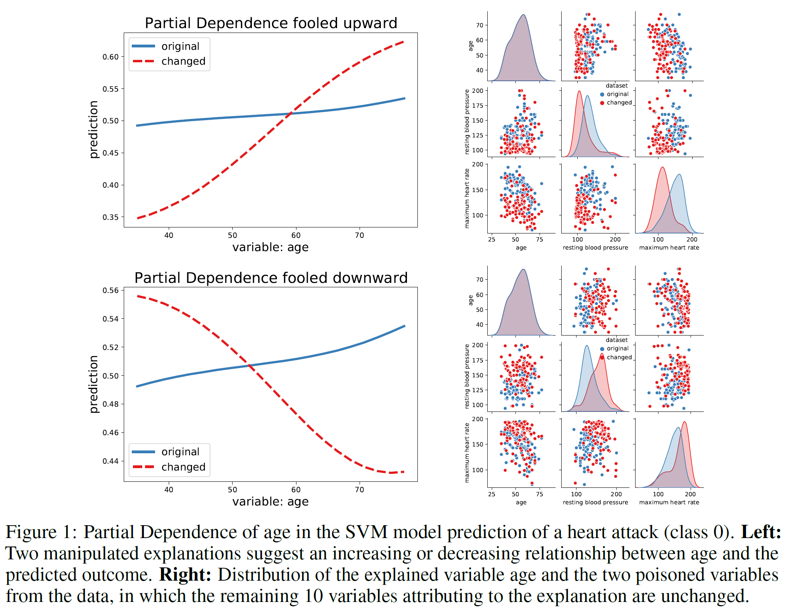
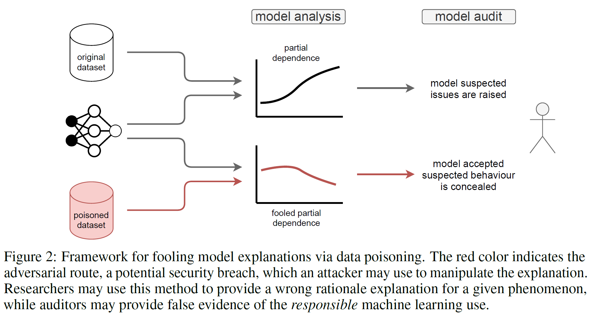
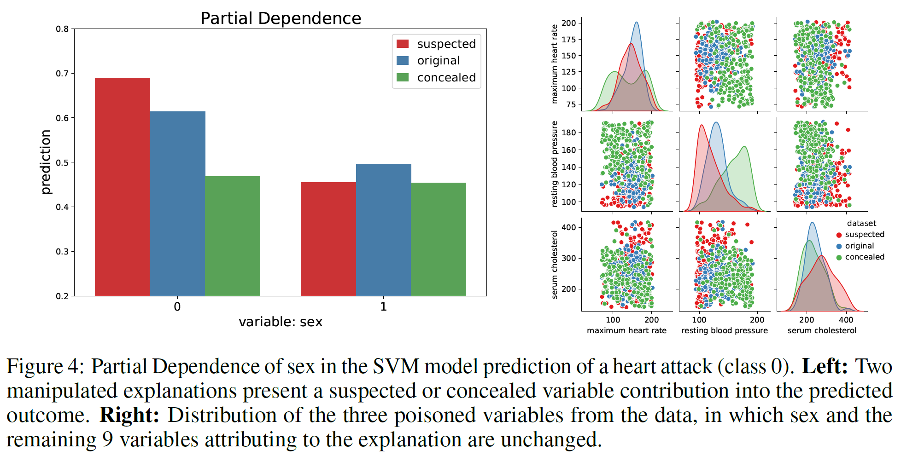

# Fooling Partial Dependence via Data Poisoning

This repository is a supplement to [Fooling Partial Dependence via Data Poisoning](https://arxiv.org/abs/2105.12837)

Baniecki, H., Kretowicz, W., and Biecek, P. **Fooling Partial Dependence via Data Poisoning** arXiv:arXiv:2105.12837  2021
> Many methods have been developed to understand complex predictive models and high expectations are placed on post-hoc model explainability. It turns out that such explanations are not robust nor trustworthy, and they can be fooled. This paper presents techniques for attacking Partial Dependence (plots, profiles, PDP), which are among the most popular methods of explaining any predictive model trained on tabular data. We showcase that PD can be manipulated in an adversarial manner, which is alarming, especially in financial or medical applications where auditability became a must-have trait supporting black-box models. The fooling is performed via poisoning the data to bend and shift explanations in the desired direction using genetic and gradient algorithms. To the best of our knowledge, this is the first work performing attacks on variable dependence explanations. The novel approach of using a genetic algorithm for doing so is highly transferable as it generalizes both ways: in a model-agnostic and an explanation-agnostic manner.

<p align="center">
  <a href="https://arxiv.org/pdf/2105.12837.pdf">
    
  </a>
  <a href="https://arxiv.org/pdf/2105.12837.pdf">
    
  </a>
</p>

## Requirements

To install requirements:

```
pip install -r requirements.txt
```

## Demo

To run a simple example:

```
python xor.py
```

Also with the parameters:

```
python xor.py --algorithm gradient --strategy check 
python xor.py --algorithm genetic --strategy target 
```

## Heart example

```
python heart-genetic.py --variable age
python heart-genetic.py --variable sex
```

<p align="center">
  <a href="https://arxiv.org/pdf/2105.12837.pdf">
    
  </a>
</p>


```
python heart-gradient.py --variable chol
python heart-gradient.py --strategy check
```

